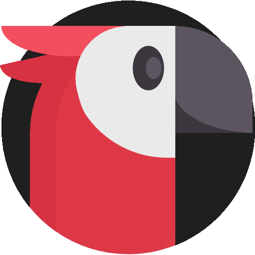
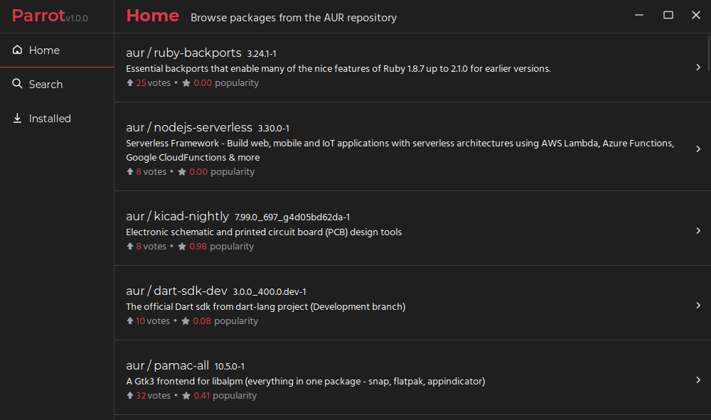

<a name="readme-top"></a>

[![Contributors][contributors-shield]][contributors-url]
[![Forks][forks-shield]][forks-url]
[![Stargazers][stars-shield]][stars-url]
[![Issues][issues-shield]][issues-url]
[![MIT License][license-shield]][license-url]

<!-- PROJECT LOGO -->
<br />
<div align="center">
  <a href="https://github.com/dan-online/Parrot">
    
  </a>

  <h3 align="center">Parrot</h3>

  <p align="center">
    A Rust-based GUI wrapper in Tauri for the Arch Linux package manager, pacman using the wrapper <code>paru</code>. Designed to be intuitive, powerful and user-friendly 
    <br />
    <a href="https://github.com/dan-online/Parrot/releases/latest">Download</a>
    ·
    <a href="https://github.com/dan-online/Parrot/issues">Report Bug</a>
    ·
    <a href="https://github.com/dan-online/Parrot/issues">Request Feature</a>
  </p>
</div>


<!-- TABLE OF CONTENTS -->
- [About The Project](#about-the-project)
- [Install](#install)
  * [Arch Linux](#arch-linux)
- [Built With](#built-with)
- [Development](#development)
  * [Prerequisites](#prerequisites)
  * [Installation](#installation)
- [Roadmap](#roadmap)
- [Contributing](#contributing)
- [License](#license)
- [Contact](#contact)


<!-- ABOUT THE PROJECT -->
## About The Project



Parrot is a GUI for the Arch Linux package manager, `paru`, a wrapper of `pacman`. Parrot is designed to provide users with a more intuitive and user-friendly way to search, manage, and install packages on their Arch Linux systems.

With Parrot's sleek GUI, users can easily browse available packages, search for specific packages, and install or uninstall them with just a few clicks. Whether you're a beginner or an advanced Arch Linux user, Parrot is a powerful tool that can help you manage your system more efficiently.

## Install

### Arch Linux

```sh
yay -S parrot-bin
```

Or use an aur helper of your choice.

## Built With

<a href="https://tauri.app">
  
</a>
<a href="https://vuejs.org">
  
</a>
<a href="https://www.rust-lang.org">
  
</a>
<a href="https://www.typescriptlang.org">
  
</a>

## Development

To get a local copy up and running follow these simple example steps.

### Prerequisites

This is an example of how to list things you need to use the software and how to install them.

* Node
* Yarn
* Rust

### Installation

1. Install the dependencies
```sh
yarn install
```
2. Run the development server
```sh
yarn tauri dev
```
3. Build the app
```sh
yarn tauri build
```

## Roadmap

- [x] Working app
- [ ] Move to `yay` instead of `paru`
- [ ] Add a settings page

See the [open issues](https://github.com/dan-online/Parrot/issues) for a full list of proposed features (and known issues).

## Contributing

Contributions are what make the open source community such an amazing place to learn, inspire, and create. Any contributions you make are **greatly appreciated**.

If you have a suggestion that would make this better, please fork the repo and create a pull request. You can also simply open an issue with the tag "enhancement".
Don't forget to give the project a star! Thanks again!

1. Fork the Project
2. Create your Feature Branch (`git checkout -b feat/AmazingFeature`)
3. Commit your Changes (`git commit -m 'Add some AmazingFeature'`)
4. Push to the Branch (`git push origin feat/AmazingFeature`)
5. Open a Pull Request

## License

Distributed under the MIT License. See [LICENSE](LICENSE) for more information.

## Contact

DanCodes - [@dan-online](https://github.com/dan-online) - <dan@dancodes.online>

Project Link: [https://github.com/dan-online/Parrot](https://github.com/dan-online/Parrot)

<!-- MARKDOWN LINKS & IMAGES -->
[contributors-shield]: https://img.shields.io/github/contributors/dan-online/Parrot.svg?style=for-the-badge
[contributors-url]: https://github.com/dan-online/Parrot/graphs/contributors
[forks-shield]: https://img.shields.io/github/forks/dan-online/Parrot.svg?style=for-the-badge
[forks-url]: https://github.com/dan-online/Parrot/network/members
[stars-shield]: https://img.shields.io/github/stars/dan-online/Parrot.svg?style=for-the-badge
[stars-url]: https://github.com/dan-online/Parrot/stargazers
[issues-shield]: https://img.shields.io/github/issues/dan-online/Parrot.svg?style=for-the-badge
[issues-url]: https://github.com/dan-online/Parrot/issues
[license-shield]: https://img.shields.io/github/license/dan-online/Parrot.svg?style=for-the-badge
[license-url]: https://github.com/dan-online/Parrot/blob/master/LICENSE.txt
[linkedin-shield]: https://img.shields.io/badge/-LinkedIn-black.svg?style=for-the-badge&logo=linkedin&colorB=555
[linkedin-url]: https://linkedin.com/in/dan-online
[product-screenshot]: images/screenshot.png
